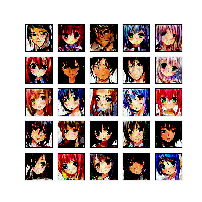
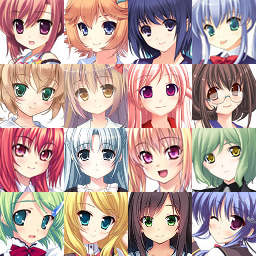

# Anime Face Generation
Implementation of Deep Convolution GAN to generate Anime Faces :heart:

Below are the pictures of characters generated by our model and some images from the training data.  

 

The model has been trained for 100 epochs and can be trained for more to obtain slightly better results. The `Discriminator.pth` and `Generator.pth` is included if one plans to continue the training of the model.

To generate the character images of resolution 64\*64 (I know this is too low), one can use `generate.py` with the arguments:
>`--path`: (Optional) Specify the path where you want to save the images.  
>`--num_images`: Number of images of Characters you want to generate.

The model can be trained using `main.py` and below are the arguments accepted by the script:  
>`--dataset`: Specify the location of the dataset to train the model.  
>`--epoch`: The number of epochs to train the model.  
>`--device`: (Optional: *default CPU*) The device on which the model is to be trained.  
>`--continue`: (Optional: *default False*) Set this as **True** if you want continue training the model.  
>`--seed`: (Optional) Set the value of seed manually to reproduce the results for an experiment.

The dataset which is used for this fun project was [Anime Faces](https://www.kaggle.com/soumikrakshit/anime-faces)  

Thanks to *GAN hacks by Soumith Chintala* (The repo can be found [here](https://www.github.com/soumith/ganhacks)) which made it much easier to train the model and help me learn many things.  

Also to Aladdin Persson's [YouTube Channel](https://www.youtube.com/channel/UCkzW5JSFwvKRjXABI-UTAkQ) which helped me to learn implement the code.
